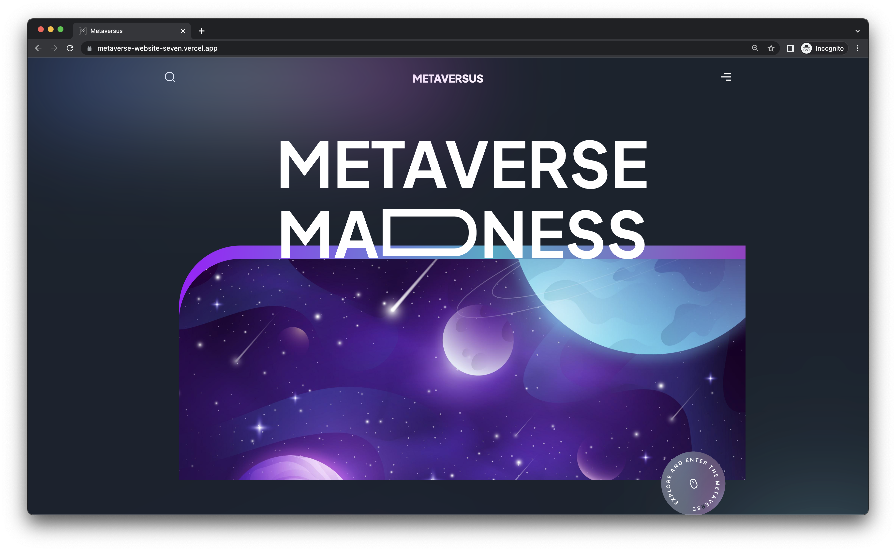

# Metaverse Website

Live Site URL: [Metaverse](https://metaverse-website-seven.vercel.app)

## Table of contents

- [About the project](#about-the-project)
  - [Built with](#built-with)
- [Getting started](#getting-started)
  - [Installation](#installation)
- [Acknowledgments](#acknowledgments)

## About the project



Simple website with animations.

### Built with

- JavaScript
- React
- Next.js
- Tailwind CSS
- [Framer Motion](https://www.framer.com/motion)

## Getting Started

1. Clone the repo:

   ```bash
   git clone https://github.com/iva-stasia/metaverse-website.git
   ```

2. Install NPM packages:

   ```bash
   npm install
   ```

3. Run the development server:

   ```bash
   npm run dev
   ```

## Acknowledgments

The application was created based on a [tutorial](https://www.youtube.com/watch?v=ugCN_gynFYw) by [JavaScript Mastery](https://www.youtube.com/@javascriptmastery).
